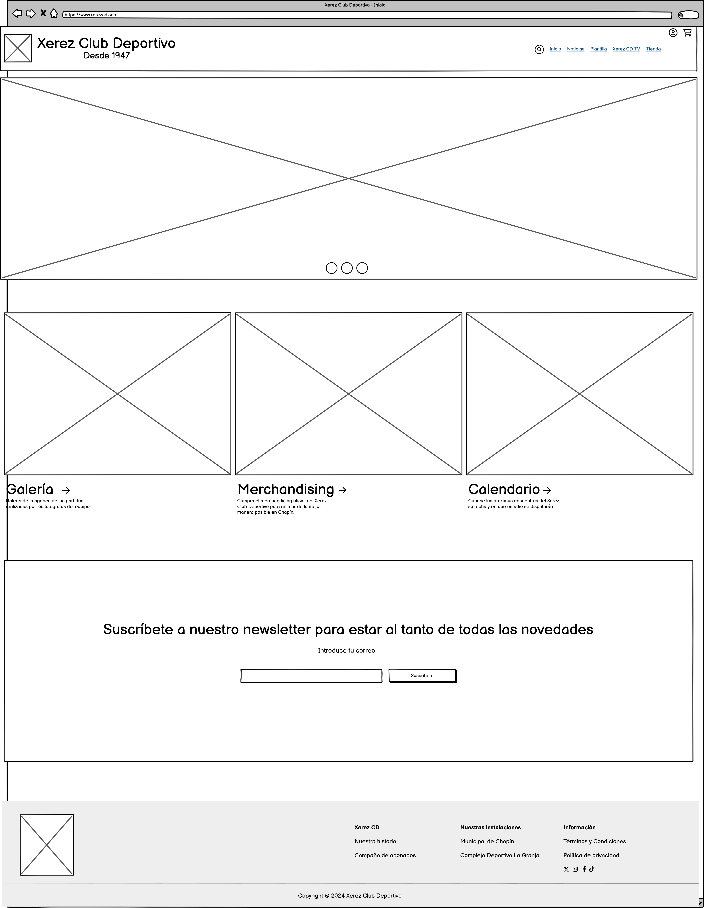

# **Proyecto: “Desarrollo de una Aplicación Web Completa con HTML5 y CSS3”**

### **Fase 1: Planificación del Proyecto (Wireframe y Estructura HTML)**

#### Actividades:
1.  **Análisis de requisitos y objetivos del proyecto:**
- Idea principal: Una página básica que permita a los aficionados encontrar información y la actualidad del Xerez de manera centralizada.

- Wireframe en Balsamiq:

- Mi proyecto al tratar de un equipo de fútbol (Xerez CD), trata de una web que recoja las necesidades de los aficionados, ¿cuáles son esas necesidades?, pues las voy a enumerar para poner un poco de contexto de como es mi web:
	- Un inicio con varios accesos, como la galería de fotos de los partidos, el merchandising del club y el calendario de partidos, a parte de un formulario para poder registrar a los aficionados en un newsletter del club.
	- Una página de noticias para mantener al tanto a los aficionados de la actualidad del club.
	- Una página de la plantilla de esta temporada, para que puedan conocer a los jugadores de su equipo tanto la cara, como sus datos (nombre, posición, edad).
	- Una página de televisión del club, para que todos puedan seguir a su equipo desde cualquier rincón del mundo y poder interactuar entre ellos mediante un chat en directo.
	- Una tienda online, para poder proporcionar la ropa y la identidad del club a todo el mundo, indistintamente de donde se encuentre. En dicha página pueden encontrar los artículos más destacados para los Xerecistas y la nueva colección de la temporada.
	- Una página de inicio de sesión, para que el aficionado pueda hacer todo y dejarlo guardado en su cuenta, ya sean compras, noticias destacadas, compra de entradas, etc.
	- Un carrito de compras, para gestionar los productos a pedir, la cantidad, poder eliminarlos, y ver el total del pedido.
	- Una página que relata la dura historia del Xerez, desde los principios hasta esta misma época.
	- Una página sobre la campaña de abonados, la cual incluye tablas con los precios de los abonos para cada tipo de persona. Desde esta, puedes ir a la compra del abono de manera online, donde podrás ver un mapa de Chapín para poder elegir el sector que más te guste.
	- Una página sobre el estadio, en la cual se podrán encontrar datos e imágenes del mismísimo Municipal de Chapín.

	-  **Generalmente la página final no se despega mucho de la idea principal hecha en el Wireframe, aunque ha sido expandida en ciertas partes.**
					
	- Estructura HTML: En todas las páginas hay una estructura principal compuesta de `<header>`, `<main>`y `<footer>`, el `<header>` se compone de dos `<section>`, un `<nav>` y `<label>` e `<input>` para el header responsive, el `<footer>` de dos  `<section>`, para dividir las zonas izquierda y derecha, de las cuales la izquierda lleva el logo y `<article>` para los datos de contacto y la derecha varios `<article>` con opciones para ser redirigido a otras páginas . El inicio se compone de 3 `<section>` para dividir el slider, de los 3 bloques de opciones y el `<form>` del newsletter. La página de noticias de un gran `<section>` con 3 `<article>` (1 por noticia), La página de la plantilla contiene **muchos** `<section>` anidados para las cartas de los jugadores. La página de Xerez CD TV, tiene 2 `<section>`, uno para la parte del vídeo y los títulos y la otra para el chat en directo. La página de la tienda tiene principalmente 2 `<section>`, uno para el slider y otro para los productos (el cual se compone de otros muchos `<section>` 😓). La página de inicio de sesión se compone de un gran `<section>`, que tiene dentro `<article>` con un `<form>`. El carrito se compone de varios `<section>`para el tema del recuadro y los artículos de la cesta. La página de la historia del equipo, tiene un gran `<section>` compuesto de muchos `
`.  La página de la campaña de abonados tiene principalmente dos `<section>`, uno para el slider y otro para las tablas de precios (con `table`). Y por último, la página del estadio, se compone de varios `<section>`, para la información, las fotos y los datos.

### **Fase 2: Diseño y Desarrollo del Frontend (HTML y CSS).**
#### Actividades:

1.  **Estructuración del proyecto:**  El proyecto cuenta con la estructura de archivos sugerida (ej.:  `/css`,  `/img`,  `/js`)  y los archivos `index.html` y `styles.css`
2. **Configuración del editor de código:**  Para el desarrollo he utilizado VS Code, con extensiones como Live Server para hacer más sencillo el proceso.
3. **Desarrollo de la Estructura HTML (al menos 7 páginas HTML):**
    -   Principalmente la página sigue los estilos del wireframe, menos en algunos sitios que he decidido hacer cambios que veía que podían mejorar la web.
    -   **Creación de la página de inicio:**
        -   La página se encuentra con un `<header>` y `<footer>` que los enlaza con el resto de páginas, y se encuentran estructuradas de una manera muy general pero apta.
    -   **Desarrollo de páginas secundarias:**
			- He puesto varias páginas, quizás algo distintas a las sugeridas, pero más acordes al tema de mi web.
    -   **Enlazado entre páginas:**  Todas las páginas se encuentran correctamente enlazadas
    -   **Producto**: En general cumple con lo requerido.
4.  **Aplicación de hojas de estilo CSS:**
    
    -   **Organización correcta de los estilos**, se encuentra organizada por el orden de páginas en la propia web.
    -   **Estilización:**
        -   He establecido variables para tener algo más general, y más sencillo.
        -   La cabecera y el header quizá tienen un estilo muy "básico" pero útil y sencillo de utilizar para el usuario.
        -   He utilizado el css para dar unos estilos acorde al tema de la web.
        -   **Efectos y transiciones en CSS:**  Muchos botones e imágenes cuentan con hover, para darle más aprecio al estilo y transiciones para suavizar el cambio.
    -   **Aplicación de diseño responsive:**
        -   La página es responsive y tiene media querys en 768px y 605px
    -   **Diseño de componentes específicos:**
        -   Hay cosas con estilos únicos, como los formularios de inicio o suscripción al newsletter, los productos de la tienda, la plantilla, y muchas más.
5.  **Producto**: Hay un único archivo css para todos los html.
6.  **Implementación de diseño responsive:**
    -   He utilizado media querys para hacer una web responsive
    -   **Producto**: Se adapta bien a la mayoría de resoluciones
7.  **Inserción de imágenes y vídeos:**
    - He integrado imágenes y vídeos en mi web
    
### **Fase 3: Implementación y Validación del Código**
#### Actividades:

1.  **Validación del código HTML:**
    
    -   He validado el HTML y verificado su funcionamiento.
    -   **Producto**: Informes de validación que muestren el estado del código HTML y los errores corregidos.
2.  **Validación del código CSS:**
    -   He validado el css y verificado su funcionamiento.
    -   **Producto**: Informes de validación de CSS y correcciones aplicadas.
3.  **Optimización y comprobación de accesibilidad, usabilidad:**
    
    -   **Optimización de rendimiento:**
- **Producto**: Informe de accesibilidad y mejoras aplicadas al proyecto.